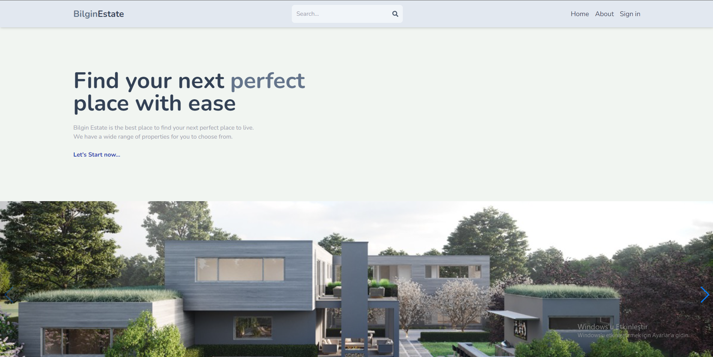
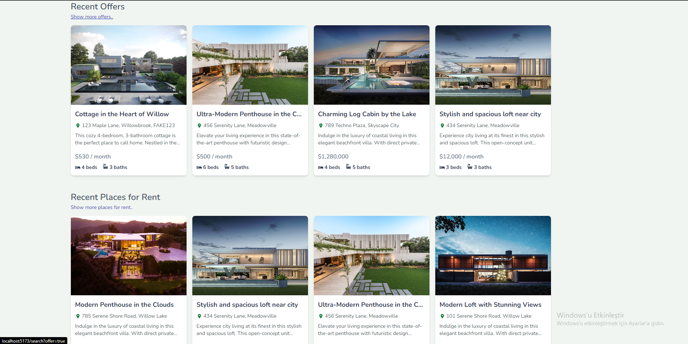
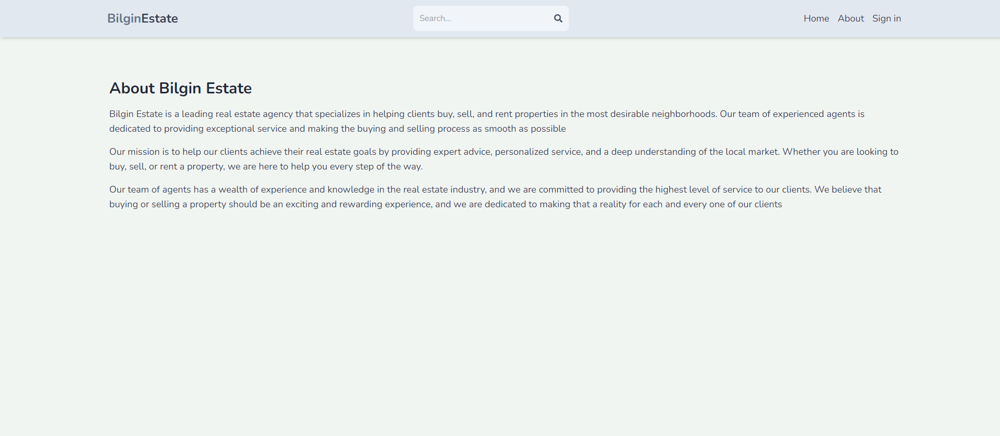
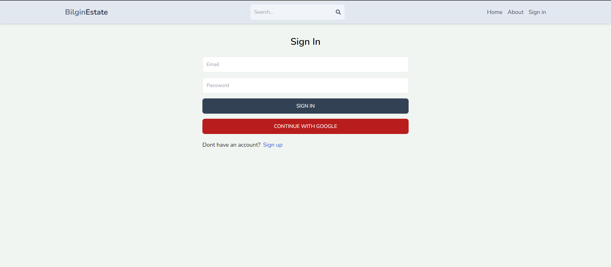

# BİLGİN ESTATE MERN PROJECT

A Real Estate application created with the MERN Stack.

## Project Overview:

Click on the image to watch the preview video!

## Links:

### Demo Link

## Frontend

The frontend of this project is created with ReactJs. Redux Toolkit and Firebase is used for the authentication.
 
To start the frontend: 

`cd client` 

`npm install` 

`npm run dev` 

Also .env file has to be created. 

.env content: 

`VITE_FIREBASE_API_KEY= from firebase` 

### Screenshots:

#### Home Page:

#### About Page:

#### Signup Page:

